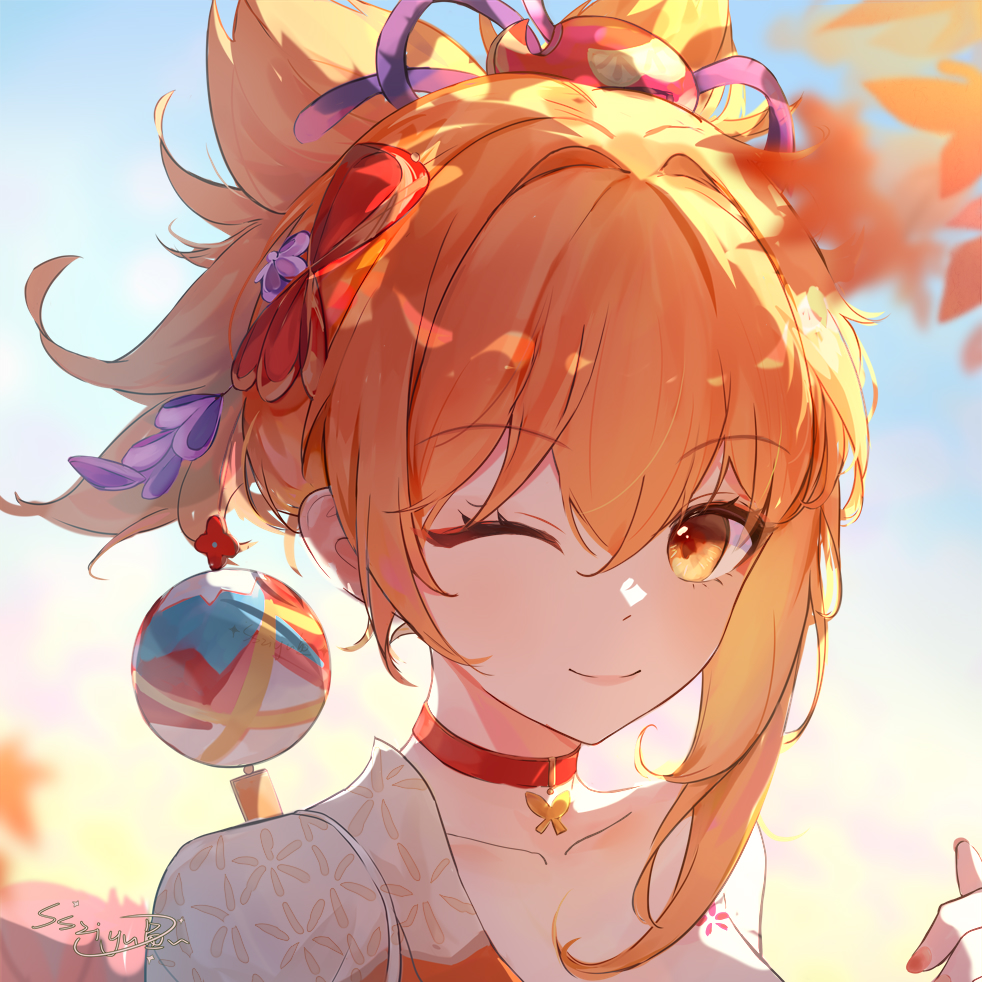

<!-- 这里可以替换成你自己的高清手绘角色线稿或插画作为 Banner 头图 -->

# Hi there, I'm Xavier 👋

### 🤖 AI Undergraduate | System & Algorithm Enthusiast | Creator

I'm a sophomore majoring in Artificial Intelligence, passionate about uncovering the magic beneath the code—from low-level computer architecture to the latest LLM applications. 

## 🚀 About Me

- 🎓 **Studying:** Artificial Intelligence, Data Structures & Algorithms.
- 🌱 **Currently Exploring:** Java development, Machine Learning and Robotics LLM integration.
- 🎨 **Beyond Code:** I love character sketching (restoring and polishing art), and I'm a big fan of Genshin Impact & Arknights!

---

## 📫 Let's Connect

  <!-- 替换为你的联系方式链接 -->
  

<!-- 底部小彩蛋 -->

  <i>May the wind guide your code. 🍃 (Venti)</i>

